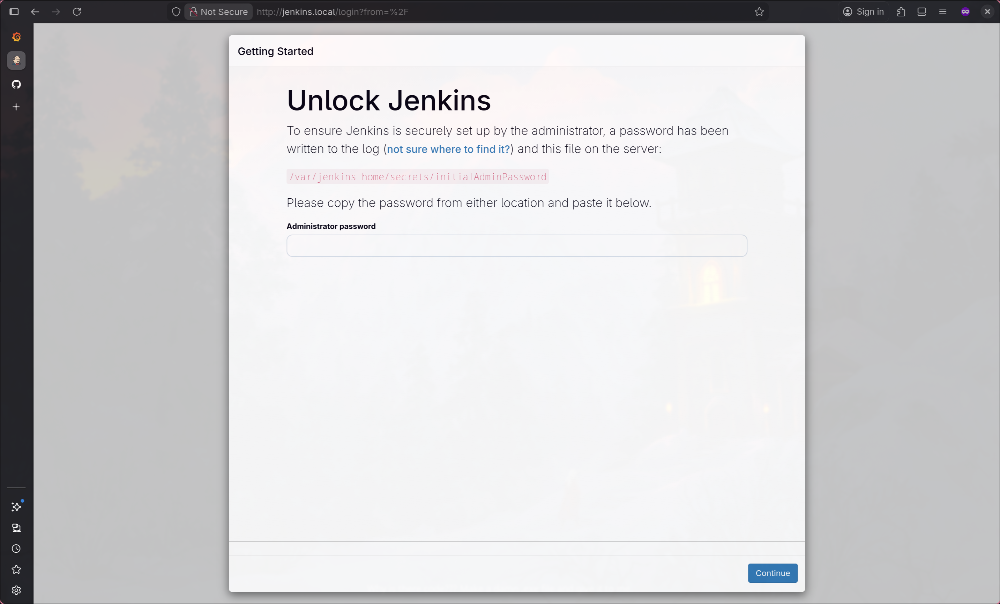
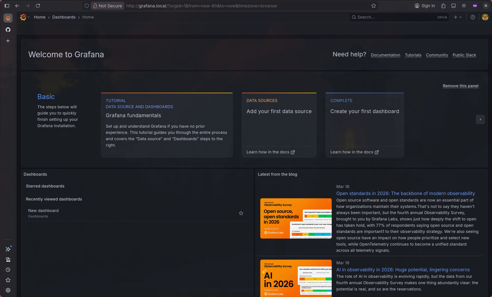

This repository contains lab materials and configuration for the course **ENG23 3074 – Serverless and Cloud Architectures** (B6603946, นายสุรเกียรติ สิงขรอาสน์).

## usage

create cluster with kind:

```bash
kind create cluster --config=kind.yaml
```

provision persistent volume directories on the kind control plane node:

```bash
docker exec kind-control-plane sh -c "mkdir -p /mnt/jenkins-data /mnt/grafana-data && chown 1000:1000 /mnt/jenkins-data && chown 472:472 /mnt/grafana-data"
```

install nginx ingress controller:

```bash
kubectl apply -f https://raw.githubusercontent.com/kubernetes/ingress-nginx/main/deploy/static/provider/kind/deploy.yaml
```

wait for the nginx ingress controller to be ready:

```bash
kubectl wait --namespace ingress-nginx \
  --for=condition=ready pod \
  --selector=app.kubernetes.io/component=controller \
  --timeout=90s
```

storageclass:

```bash
kubectl apply -f storageclass.yaml
```

devops-tools:

```bash
kubectl apply -f devops-tools/namespace.yaml
kubectl apply -f devops-tools/pv.yaml
kubectl apply -f devops-tools/pvc.yaml
kubectl apply -f devops-tools/jenkins.yaml
kubectl apply -f devops-tools/ingress.yaml
```

monitoring:

```bash
kubectl apply -f monitoring/namespace.yaml
kubectl apply -f monitoring/pv.yaml
kubectl apply -f monitoring/pvc.yaml
kubectl apply -f monitoring/grafana.yaml
kubectl apply -f monitoring/ingress.yaml
```

wait for jenkins and grafana to be ready

```bash
kubectl wait --namespace devops-tools \
  --for=condition=ready pod \
  --selector=app=jenkins \
  --timeout=300s

kubectl wait --namespace monitoring \
  --for=condition=ready pod \
  --selector=app=grafana \
  --timeout=300s
```

get the initial admin password:

```bash
kubectl exec -n devops-tools -it deployment/jenkins -- cat /var/jenkins_home/secrets/initialAdminPassword
```

## using the makefile

you can automate all the above steps using the provided `Makefile`:

- `make all`: creates the cluster, installs the nginx ingress controller, deploys jenkins, and fetches the admin password.
- `make clean`: destroys the kind cluster when you are done.

 

